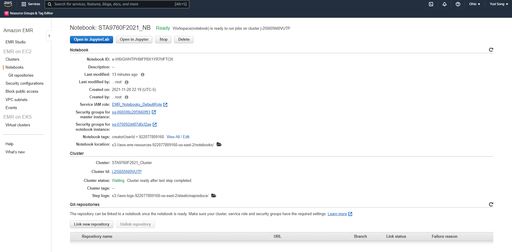
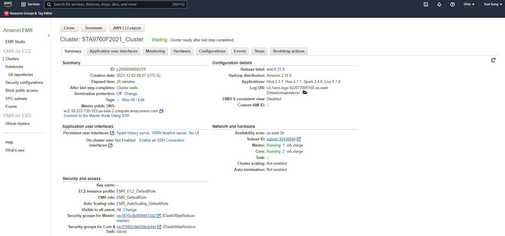

# Analyzing 10Gb of Yelp Reviews Data

In this project02, I analyzed Yelp dataset, such as, business, review, and user data. I downloaded its zip file from Kaggle and extracted it. Then I uploaded it to my AWS S3 bucket. 
Two screenshots below display how I configured AWS EMR Clusters and Notebook. 
## Cluster and Notebook Configs

# Part1: Installation and Initial Setup
I installed and imported necessary libraries including pandas, matplotlib, seaborn, scipy, and so on. Also, loaded Yelp dataset as a PySpark dataframe from my S3 bucket. 
# Part2: Analyzing Categories
I loaded and analyzed categories of business data. I split categories into unique categories and displayed top 20 most popular categories, then I visualized as a bar chart of top 20 categories.
# Part3: Do Yelp Reviews Skew Negative?
I loaded and analyzed review data. Then I compared and analyzed reviews and ratings from Yelp review and business dataset. Thus, I created a skew distribution plot, and I got positive skewness values. It proofed that reviewer who left a written response were more satisfied than normal.
# Part4: Should the Elite be Trusted?
I loaded and analyzed user data from my S3 bucket. I selected three necessary columns, such as, user id, elite, and average stars. I compared it with Yelp review and business dataset. The skewness value I got is positive. Therefore, elite users should be trusted. 

