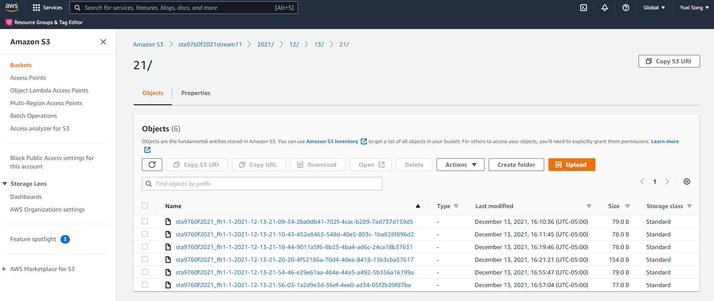

# Yahoo Finance Data Streaming with AWS Lambda

In this project, I provisioned a Lambda function to generate near real-time finance data records for querying.

This project is broken into three parts:
●	Infrastructure 
●	Data collection
●	Data analysis

### Data Transformation
I am using the yfinance module get the pricing imformation of the following stock:
Facebook (FB)
Shopify (SHOP)
Beyond Meat (BYND)
Netflix (NFLX)
Pinterest (PINS)
Square (SQ)
The Trade Desk (TTD)
Okta (OKTA)
Snap (SNAP)
Datadog (DDOG)
I collected HIGH and LOW prices for each company listed above on Tuesday, November 30th 2021, at a five minute interval.

### Data Collector and Data Analyzer
You can see the source code for the lambda function in "data_transformer.py". 
I set up a Glue crawler so I could run AWS Athena queries with financial data. In Athena, I wrote and run a query in SQL that generated the highest hourly stock price per company from the list above. The query was saved in "query.sql". The result was saved in 'results.csv'.

### Data Visualizations
According to the result above, I created two data visualizations in Python. You can see my visualizations in 'Analysis.ipynb'

### Screenshot of a Monitoring page in the Kinesis data firehose.

### Screenshot of S3 Bucket

